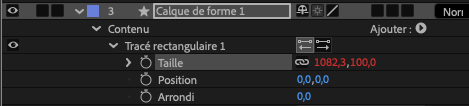

# Les bases et la syntaxe

Sommaire :

* [c'est quoi donc ?](#cestquoi)
* [du JavaScript dans AE](#javascript)
* [Ressources](#ressources)

<span id="cestquoi"></span>
## C'est quoi une Expression ? 

Une expression est TOUJOURS attachée à une propriété et une seule, et ne fera qu'une seule chose : envoyer un résultat à cette propriété.
Vous pouvez appliquer une expression à n'importe quelle propriété **animable**.

[](../images/proprietes.png)

Dans cet exemple, la propriété "Taille" a une expression (les valeurs sont rouges). Il est essentiel de noter que la propriété "Taille" ou la propriété "Position" possèdent 2 valeurs alors que la propriété "Arrondi" n'en possède qu'une. C'est logique, la taille s'exprime en largeur et hauteur, la position s'exprime en position x ou position y, l'arrondi s'exprime lui avec une seule valeur, en pixels.
Ce qui est important de comprendre c'est qu'une expression DEVRA RENVOYER UNE VALEUR SIMILAIRE. Si le résultat d'une expression appliquée à la propriété Position est par exemple 12, alors message d'erreur que nous pourrons traduire par "ah non, pas possible, pour cette propriété il me faut 2 valeurs séparées par une virgule." Ceci est valable pour toutes les propriétés.

Une expression peut récupérer la valeur d'une autre propriété mais NE PEUT PAS MODIFIER une valeur autre que celle dans laquelle elle est écrite. Une expression NE PEUT PAS créer des éléments, pour cela il faudra passer par un script et c'est une toute autre histoire.

Une expression est donc un mini programme , à chaque frame, After Effects **évalue ce code** et renvoie le résultat comme valeur de la propriété.

> 💡 Analogie : une image clé dit : "à ce moment précis, la valeur est X" et c'est l'utilisateur qui définit cette valeur. Une expression dit *"calcule toi-même la valeur en fonction de règles"*.

> 💡 Pour créer une expression : Alt + Clic sur le chrono de la propriété
> 💡 Pour voir si des expressions sont déjà présente : E E 
> - si un layer est sélectionné, cela affiche toutes les propriétés de ce layer qui possèdent une expression
> - si aucun layer n'est sélectionné, cela affiche toutes les propriétés de la compo qui possèdent une expression.
> 💡 Autocompletion : pas besoin de taper tous les éléments d'une expression, AE possède un système d'auto-remplissage dès que tu commence à entrer une expression

___

<span id="javascript"></span>
## JavaScript dans AE 

Imaginons que JavaScript Standard est la langue Française, AE parle un dialecte régional : la grammaire est la même mais le vocabulaire peut être différent.

Ce qui est identique (la grammaire) :

* les fonctions de base de JS fonctionnent dans AE : les variables, les conditions, les fonctions, les formules mathématiques

Ce qui est différent (le dialecte) :

* Comme dit précédemment, une expression vit *à l'intérieur* d'une propriété. En JS standard, tu écris un programme qui tourne une fois. Dans AE, chaque expression est **réévaluée à chaque frame**, comme si AE appelait ta fonction automatiquement 25 fois par seconde.
* Dans AE, un ensemble de variables et objets sont **disponibles automatiquement** dans chaque expression :

```
// Ces variables existent SANS que tu les déclares
time          // temps courant de la comp en secondes (Number)
thisComp      // la composition courante (Object)
thisLayer     // le calque qui porte l'expression (Object)
thisProperty  // la propriété elle-même (Object)
value         // la valeur actuelle de la propriété SANS expression (très utile)
```

* AE possède ses propres objets avec leurs propres méthodes :

```
// Objet Layer → accéder à un autre calque
thisComp.layer("Mon Calque")         // par nom
thisComp.layer(1)                    // par index (commence à 1, pas 0 !)
// Objet Composition
thisComp.duration                    // durée totale en secondes
thisComp.width                       // largeur en pixels
// Objet Property → lire une valeur à un instant précis
thisLayer.opacity.valueAtTime(0)     // opacity à t=0
// Méthodes de transformation
wiggle(5, 30)                        // oscillation aléatoire – propre à AE
linear(t, tMin, tMax, v1, v2)        // interpolation – propre à AE
```

Ces méthodes **n'existent pas** en JavaScript standard. C'est le vocabulaire du dialecte.

* Les types de retour attendus varient selon la propriété et c'est souvent une source d'erreur courante au début.

```
// Propriété scalaire (Opacity, Rotation) → retourner un Number
time * 10                           // ✅ un seul nombre
 
// Propriété vectorielle (Position, Scale) → retourner un Array
[thisComp.width / 2, time * 100]    // ✅ [x, y]
 
// Propriété texte (Source Text) → retourner une String
"Frame : " + timeToFrames(time)     // ✅ chaîne de caractères
```

Si tu retournes le mauvais type, AE affiche une erreur .

### Déclarer des variables : `const`, `let` ... mais plus `var`

> 💡 Pour info, au moment où j'écris ce cours, je découvre l'information ! Honte sur moi :-)
> Il n'est donc pas impossible que mes exemples comporte plein de `var`

Depuis CC 2019, AE utilise le moteur JavaScript **V8** (le même que Node.js et Chrome), qui supporte pleinement ES6+. Cela signifie que `const` et `let` fonctionnent nativement dans toutes vos expressions.

**La règle :** n'utilisez jamais `var` dans vos expressions.

| Mot-clé | Portée | Réassignable | À utiliser |
|---|---|---|---|
| `const` | bloc `{}` | non | valeur fixe |
| `let` | bloc `{}` | oui | valeur qui change |
| `var` | fonction | oui | ❌ jamais |

```javascript
// ❌ À éviter — héritage ES3, comportement imprévisible
var vitesse = wiggle(3, 40);

// ✅ Correct — valeur calculée une fois, non réassignée
const vitesse = wiggle(3, 40);

// ✅ Correct — valeur modifiée dans une boucle ou condition
let angle = 0;
if (time > 1) angle = time * 90;
angle
```

> 💡 Pour aller au fond des choses : `var` "remonte" au sommet de la fonction (*hoisting*), ce qui peut créer des bugs silencieux difficiles à diagnostiquer. `const` et `let` sont limités à leur bloc `{}` : les erreurs sont détectées immédiatement, les expressions sont plus lisibles et plus sûres.

Vous rencontrerez souvent `var` dans de vieux tutoriels ou exemples sur le web, ne le reproduisez pas et utiliser à la place `const` ou `let`

## Syntaxe

A première vue, il n'est pas évident de traduire une expression mais lorsque vous comprenez la syntaxe, ça devient plus simple. Pour ça il faut bien comprendre l'utilisation du '.' et la hiérarchie des éléments.

Prenons l'exemple de ce bout d'expression :

```
thisComp.layer(1).position.value[1]
```

```
thisComp      // l'objet racine : la composition
  .layer(1)   // on descend dans un de ses enfants : le calque
    .position // on descend encore : une propriété de ce calque
      .value  // on atteint la valeur finale
```

<span id="ressources"></span>
## 2 sources essentielles 

Vous avez sur ces 2 pages l'ensemble des fonctions, objets, méthodes ... pour le JavaScript et pour AE. Conseil : gardez ouvertes c'est 2 pages pendant que vous travaillez sur des expressions, c'est une mine !

* Référence du langage JavaScript -> <https://developer.mozilla.org/fr/docs/Web/JavaScript/Reference>
* Référence du langage Expression AE -> <https://ae-expressions.docsforadobe.dev/>
