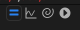

# Les bases et la syntaxe

Sommaire :

* [c'est quoi donc ?](#cestquoi)
* [du JavaScript dans AE](#javascript)
* [La syntaxe](#syntaxe)
* [Le pickwhip](#pickwhip)
* [Ressources](#ressources)

<span id="cestquoi"></span>
## C'est quoi une Expression ? 

Une expression est TOUJOURS attachée à une propriété et une seule, et ne fera qu'une seule chose : envoyer un résultat à cette propriété.
Vous pouvez appliquer une expression à n'importe quelle propriété **animable**.

[](../images/proprietes.png)

Dans cet exemple, la propriété "Taille" a une expression (les valeurs sont rouges). Il est essentiel de noter que la propriété "Taille" ou la propriété "Position" possèdent 2 valeurs alors que la propriété "Arrondi" n'en possède qu'une. C'est logique, la taille s'exprime en largeur et hauteur, la position s'exprime en position x ou position y, l'arrondi s'exprime lui avec une seule valeur, en pixels.
Ce qui est important de comprendre c'est qu'une expression DEVRA RENVOYER UNE VALEUR SIMILAIRE. Si le résultat d'une expression appliquée à la propriété Position est par exemple 12, alors message d'erreur que nous pourrons traduire par "ah non, pas possible, pour cette propriété il me faut 2 valeurs séparées par une virgule." Ceci est valable pour toutes les propriétés.

Une expression peut récupérer la valeur d'une autre propriété mais NE PEUT PAS MODIFIER une valeur autre que celle dans laquelle elle est écrite. Une expression NE PEUT PAS créer des éléments, pour cela il faudra passer par un script et c'est une toute autre histoire.

Une expression est donc un mini programme , à chaque frame, After Effects **évalue ce code** et renvoie le résultat comme valeur de la propriété.

> 💡 Analogie : une image clé dit : "à ce moment précis, la valeur est X" et c'est l'utilisateur qui définit cette valeur. Une expression dit *"calcule toi-même la valeur en fonction de règles"*.

> 💡 Pour créer une expression : Alt + Clic sur le chrono de la propriété
> 💡 Pour ouvrir les expressions d'un layer : E E 
> 	- si un layer est sélectionné, cela affiche toutes les propriétés de ce layer qui possèdent une expression
> 	- si aucun layer n'est sélectionné, cela affiche toutes les propriétés de la compo qui possèdent une expression.
> 💡 Autocompletion : pas besoin de taper tous les éléments d'une expression, AE possède un système d'auto-remplissage dès que tu commence à entrer une expression.

---

<span id="javascript"></span>
## JavaScript dans AE 

Imaginons que JavaScript Standard est la langue Française, AE parle un dialecte régional : la grammaire est la même mais le vocabulaire peut être différent.

Ce qui est identique (la grammaire) :

* les fonctions de base de JS fonctionnent dans AE : les variables, les conditions, les fonctions, les formules mathématiques

Ce qui est différent (le dialecte) :

* Comme dit précédemment, une expression vit *à l'intérieur* d'une propriété. En JS standard, tu écris un programme qui tourne une fois. Dans AE, chaque expression est **réévaluée à chaque frame**, comme si AE appelait ta fonction automatiquement 25 fois par seconde.
* Dans AE, un ensemble de variables et objets sont **disponibles automatiquement** dans chaque expression :

```
// Ces variables existent SANS que tu ais besoin de les déclarer :
time          // temps courant de la comp en secondes (Number)
thisComp      // la composition courante (Object)
thisLayer     // le calque qui porte l'expression (Object)
thisProperty  // la propriété elle-même (Object)
value         // la valeur actuelle de la propriété SANS expression (très utile)
```

* AE possède ses propres objets (ce n'est plus du JavaScript) avec leurs propres méthodes :

```
// Objet Layer : accéder à un autre calque
thisComp.layer("Mon Calque")         // par nom
thisComp.layer(1)                    // par index (commence à 1, pas 0 !)
// Objet Composition
thisComp.duration                    // durée totale en secondes
thisComp.width                       // largeur en pixels
// Objet Property : lire une valeur à un instant précis
thisLayer.opacity.valueAtTime(0)     // opacity à t=0
// Méthodes de transformation
wiggle(5, 30)                        // oscillation aléatoire, propre à AE
linear(t, tMin, tMax, v1, v2)        // interpolation, propre à AE
```

Ces méthodes **n'existent pas** en JavaScript standard. C'est le vocabulaire du dialecte.

* Les types de retour attendus varient selon la propriété et c'est souvent une source d'erreur courante au début.

```
// Propriété scalaire (Opacity, Rotation) : retourner un Number
time * 10                           // ✅ un seul nombre
 
// Propriété vectorielle (Position, Scale) : retourner un Array -> un chapitre spécial y est consacré : 4. Les tableaux ARRAYS
[thisComp.width / 2, time * 100]    // ✅ [x, y]
 
// Propriété texte (Source Text) : retourner une String
"Frame : " + timeToFrames(time)     // ✅ chaîne de caractères
```

Si tu retournes le mauvais type, AE affiche une erreur.
Je reprends ici l'exemple donné en début de page :
[](../images/proprietes.png)

### Déclarer des variables : `const`, `let` 

Une variable est une **boîte nommée** qui stocke un résultat pour le réutiliser ailleurs dans l'expression. Sans variable, on serait obligé de répéter le même calcul plusieurs fois.

```javascript
// Sans variable : le calcul wiggle() est appelé deux fois,
// ce qui donne deux résultats différents à chaque frame
[wiggle(3, 40)[0], wiggle(3, 40)[1]]  // ❌ incohérent

// Avec variable : wiggle() est calculé une seule fois,
// le résultat est réutilisé pour X et Y
const w = wiggle(3, 40);
[w[0], w[1]]                          // ✅ cohérent
```

Dans AE, on déclare une variable avec `const` ou `let` selon l'usage :

| Mot-clé | La valeur peut changer ? | Exemple typique |
|---|---|---|
| `const` | non | stocker un calcul, une référence de calque |
| `let` | oui | un compteur, une valeur modifiée dans une condition |

```javascript
// const : la valeur est calculée une fois et ne change pas
const vitesse = wiggle(3, 40);
const calque = thisComp.layer("Titre");
// tu vas utiliser const dans 99% des cas

// let : la valeur est modifiée ensuite
let angle = 0;
if (time > 1) angle = time * 90;
angle
```

#### Ne plus utiliser `var`

Un troisième mot-clé existe : `var`. Vous le rencontrerez fréquemment **dans de vieux tutoriels**. Ne l'utilisez pas : son comportement est imprévisible dans les expressions (ses valeurs "remontent" hors de leur bloc, ce qui crée des bugs silencieux). `const` et `let` sont plus lisibles, plus sûrs, et détectent les erreurs immédiatement.

> 🤨Pour info, au moment où j'écris ce cours, je découvre l'information ! Honte sur moi :-)
> Il n'est donc pas impossible que mes exemples comporte plein de `var`

L'explication :
> Depuis CC 2019, AE utilise le moteur JavaScript **V8** (le même que Node.js et Chrome), qui supporte pleinement ES6+. Cela signifie que `const` et `let` fonctionnent nativement dans toutes vos expressions.

**La règle :** n'utilisez plus jamais `var` dans vos expressions.

---

<span id="syntaxe"></span>
## Syntaxe

A première vue, il n'est pas évident de traduire une expression mais lorsque vous comprenez la syntaxe, ça devient plus simple. Pour ça il faut bien comprendre l'utilisation du '.' et la hiérarchie des éléments.

Prenons l'exemple de ce bout d'expression :

```
thisComp.layer(1).position.value[1]
```
on pourrait l'imaginer sous cette forme :
```
thisComp      // l'objet racine : la composition
  .layer(1)   // on descend dans un de ses enfants : le calque
    .position // on descend encore : une propriété de ce calque
      .value  // on atteint la valeur finale
```

> **À retenir :** les noms de fonctions et de propriétés suivent la convention camelCase : le premier mot commence en minuscule, les mots suivants commencent en majuscule. Ex : `seedRandom()`, `toFixed()`, `wiggle()` pour les fonctions ; `thisLayer`, `thisComp`, `numKeys` pour les propriétés et objets.

> **À ne pas forcément retenir :** dans ce cours, je vous donne plein d'exemples qui pourront peut-être vous sembler "compliqués". L'important c'est de **connaitre leur existence** et de comprendre leur construction, pas de les retenir par coeur. Vous pourrez, à tout moment, ouvrir cette formation pour y piocher ce dont vous avez besoin.

---

<span id="pickwhip"></span>
## Le pickwhip

Le **pickwhip** (le "fouet") même si visuellement on est plus proche d'un escargot, c'est l'outil le plus rapide pour créer un lien entre deux propriétés sans écrire une expression à la main. Il génère automatiquement le code de la propriété que tu cible.
[](../images/pickwhip.png)

### Comment l'utiliser

1. Alt + Clic sur le chrono d'une propriété pour créer une expression vide.
2. Dans le champ d'expression, un petit symbole apparaît : l'icône pickwhip (un cercle avec une spirale). Clique dessus et **maintiens** le bouton de la souris.
3. **Glisse** le pickwhip vers la propriété cible (sur n'importe quel calque de la compo).
4. Relâche : AE écrit tout seul l'expression correspondante.

> 💡 Le pickwhip fonctionne aussi entre calques de comps différentes, à condition que les deux comps soient ouvertes dans le panneau Timeline.

### Ce qu'il génère

Selon la cible, AE produit une expression de ce type :

```javascript
// Lier l'opacité d'un calque à l'opacité d'un autre
thisComp.layer("Calque source").transform.opacity

// Lier la position X d'un calque à un slider (Expression Control)
thisComp.layer("Null 1").effect("Curseur")("Curseur")
```

Tu peux ensuite **modifier librement** l'expression générée, par exemple pour n'en garder qu'une composante ou y ajouter un calcul :

```javascript
// Récupérer uniquement la valeur Y de la position d'un autre calque
const source = thisComp.layer("Calque source").transform.position;
[value[0], source[1]]   // X de ce calque, Y du calque source
```

### Pickwhip et hiérarchie des propriétés

Le code généré par le pickwhip suit exactement la logique de hiérarchie décrite dans la section Syntaxe ci-dessus. C'est d'ailleurs un excellent moyen d'apprendre cette syntaxe : utilise le pickwhip, observe ce qu'il écrit, puis lis-le à voix haute en suivant les `.` de gauche à droite.

> 💡 Le pickwhip est aussi disponible dans le panneau **Essential Graphics** pour exposer des propriétés en tant que Master Properties.

---

<span id="ressources"></span>
## 2 sources essentielles 

Vous avez sur ces 2 pages l'ensemble des fonctions, objets, méthodes ... pour le JavaScript et pour AE. Conseil : gardez ouvertes c'est 2 pages pendant que vous travaillez sur des expressions, c'est une mine !

* Référence du langage JavaScript -> <https://developer.mozilla.org/fr/docs/Web/JavaScript/Reference>
* Référence du langage Expression AE -> <https://ae-expressions.docsforadobe.dev/>
